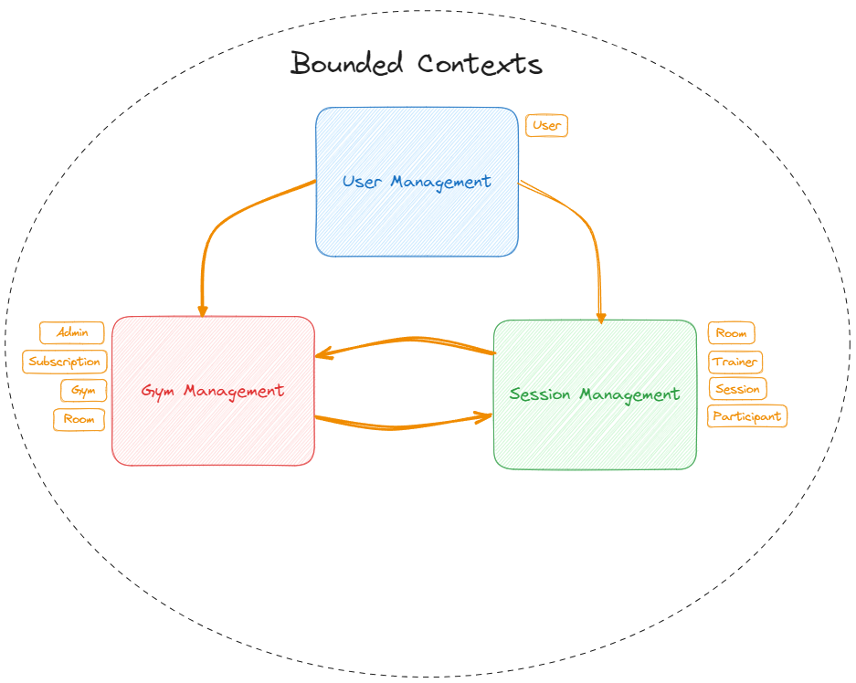
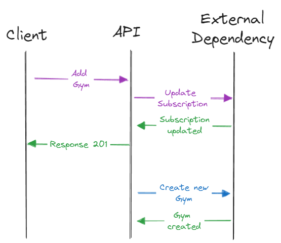
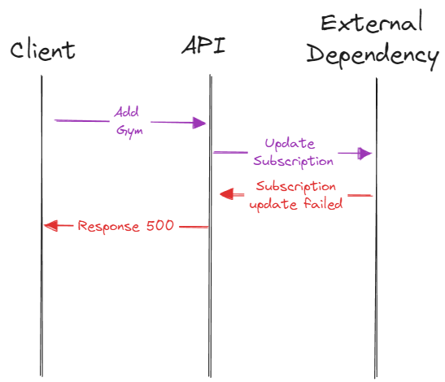
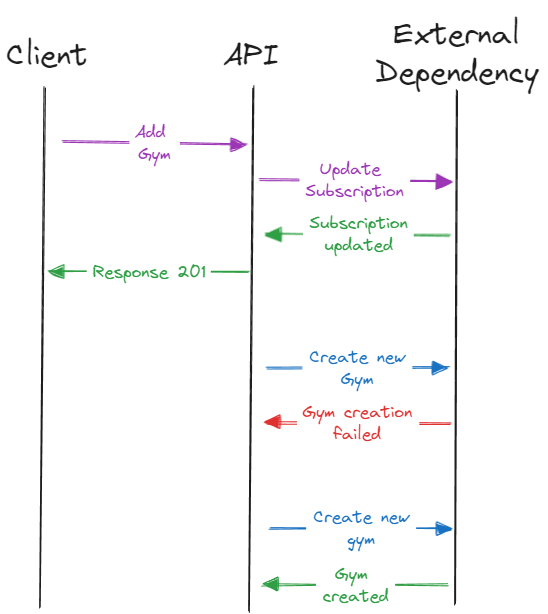
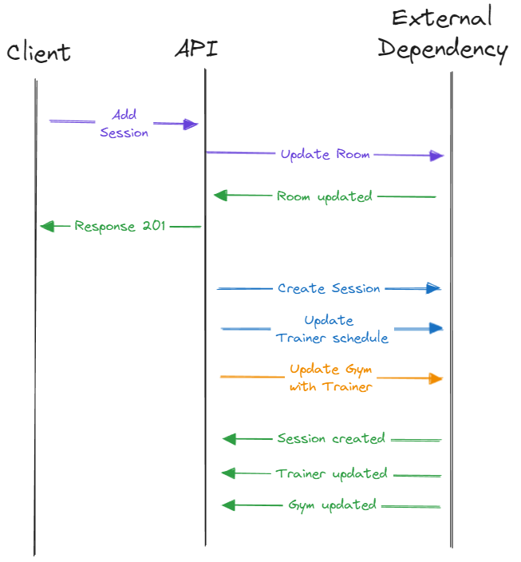

# Gymanager

## Introduction

Small project I started to mess around both with _Java_ and _Domain Driven Design_ (DDD) concepts. Shout out to 
[Amichai Mantinbad's DDD course](https://dometrain.com/course/getting-started-domain-driven-design-ddd/), where I 
learnt some of the concepts applied here.

It is a basic _REST API_ which would aim to provide the backend for a gym manager service where users could 
register their gyms as gym owners. Then, other users could participate as either trainers or 
participants of the various gym training sessions. For storage a simple _PostgreSQL DB_ is used.

## Key frameworks and libraries

- [Spring Boot 3](https://spring.io/projects/spring-boot);
- [Spring Modulith](https://spring.io/projects/spring-modulith);
- [PipelinR](https://github.com/sizovs/PipelinR), very similar to the _.NET_ famous
[MediatR](https://github.com/jbogard/MediatR) which I use quite a lot (since I do mainly _.NET_ at work) to implement 
a CQRS(ish) pattern where each request is separated in its own **command/query** and respective **handler**.
- [jOOQ](https://www.jooq.org/) for data access.
- [Flyway](https://github.com/flyway/flyway) for database migrations.
- [Spock Framework](https://spockframework.org/) for unit and integration testing.
- [Test Containers](https://testcontainers.com/) for integration testing.

## The Ubiquitous Language 💬

### Users

- A `user` can `create` an `admin profile`.
- An `admin` can have a `subscription` on the platform by `subscribing`.
- A `user` can `create` a `trainer profile`.
- A `trainer` can `add` `sessions` across several `gyms`.
- A `user` can `create` a `participant profile`.
- A `participant` can make a `session reservation` to participate in a `session`.
- A `participant` can `cancel` their `session reservation`.

### Subscriptions

- A `subscription` can be of type `Free`, `Starter` or `Pro`.
- A `subscription` has a `maximum number` of `gyms`, `rooms` and `sessions` depending on the `subscription` type.

### Gyms

- A `gym` can have multiple `rooms`.
- A `gym` has a `subscription` attached which will define how many `rooms` it can have. 
- A `gym` can `support` multiple `session categories` (like bike, pilates, functional).
- A `gym` can have multiple `trainers`.

### Rooms

- A `session` can be `reserved` in a `room` by `trainers`.
- A `room` has a maximum number of `daily sessions` depending on the `subscription`.

### Sessions

- A `trainer` can add a `session` for a given `gym`. 
- There should be only one `trainer` for a given `session`.
- `Sessions` should have a `maximum number` of `participants` set by the `trainer`.
- A `session` has a `category` (like pilates or functional), which must be available on the `gym` where they are added.
- Participants can make a `session reservation` to participate in it.

## Invariants 📝

### Admins 

- An `admin` cannot have more than one `active subscription`.

### Trainers

- A `trainer` cannot `reserve` overlapping `sessions`.

### Participants

- A `participant` cannot `reserve` overlapping `sessions`.

### Subscriptions

- A `subscription` cannot have more `gyms` than the `subscription` allows:
    - **Free**: 1.
    - **Starter**: 3.
    - **Pro**: Unlimited.
- A `subscription` cannot allow more `rooms` than the `subscription` allows:
    - **Free**: 1.
    - **Starter**: 10.
    - **Pro**: Unlimited.
- A `subscription` cannot allow more `sessions` than the `subscription` allows:
    - **Free**: 3.
    - **Starter**: Unlimited.
    - **Pro**: Unlimited.

### Gyms

- A `gym` cannot have more `rooms` than the `subscription` allows.
- A `gym` only support certain `session categories`.

### Rooms

- A `room` cannot have more `sessions` than the `subscription` allows.
- A `room` cannot have two or more overlapping `sessions`.

### Sessions

- A `session` cannot contain more than the maximum number of `participants` set by the `trainer`.
- A `session reservation` cannot be `cancelled` less than 24h before the `session` `start time`.

## Bounded Contexts 🚧

With the several **domain models** identified, the solution was divided into 3 **bounded contexts**:
- **User Management**: responsible for the `users` management (registration, login), which can be `trainers`, 
`participants` and/or `admins`.
- **Gym Management**: responsible for `admins`, `subscriptions`, `gyms` management and communicating any downstream 
request of `room` to the **Session Management** bounded context.
- **Session Management**: management of `rooms`, `sessions`, `trainers`, `participants` and `session reservations`. It
should have a `gym` model only to fetch the supported `session categories` supported by a **gym** where the `trainer`
intends to add a `session`.



## Design Choices 🧱

### Architecture 

Each **bounded context** is separated on its own **package**. Any shared code is under a `common` **package**.

Also, each **bounded context** follows the _Clean Architecture_. Some main points:
- **API**: presentation layer of all **bounded contexts**, with the controllers and any middleware like exception 
handlers.
- **Application**: application logic resides here. Hard rule to not mention any implementations, 
the data could come virtually from anywhere, so no data access/ORM libraries references (like _JPA_, _JDBC_ or in this 
case _jOOQ_). All abstractions (conveyed as `gateways`) of the **Infrastructure** layer are defined with interfaces here (but no
implementations!) and should only work with the **Domain** layer models.
- **Infrastructure**: implementations of the abstractions (`gateways`) defined in the **Application** layer, like 
repositories. Here resides the references to data access/ORM libraries, in this case _jOOQ_. Other stuff like the 
token generation services (for security) implementations are also defined here.
- **Domain**: all business logic resides here and by extension all **domain models**. An effort was made to make them 
**rich domain models** to encapsulate the business logic on the model and also to make them **always valid models**.

### Eventual Consistency

Instead of a **transactional consistency** for each request, an **eventual consistency** approach was implemented. 
Meaning, when something interesting from a business perspective occurs, instead of updating all relevant entities in a
single transaction, only one entity is changed and the response is given to the client immediately. Any further changes 
will occur on the background.

While this brings further complexity, the client no longer has to wait on the whole transaction and allows to customize what happens when certain changes
within and between the **bounded contexts** fail. Any failed event will go to the database and will be republished 
either on restart or on a scheduled job. To simplify, _Spring Modulith_ out of the box features, like
[application events](https://docs.spring.io/spring-modulith/reference/events.html), were used.

Mainly two type of events are used, **domain events** (within the **bounded context**) and **integration events**
(between **bounded contexts**).

#### Domain Events

An example of a **domain event** is when adding a `gym`: 

- The request should cause the `gym` to be added to the `subscription`. If it succeeds, it returns a `201` code 
response to the client right away, and it will trigger an **event**.

This **event** should lead to (on the background):

- The `gym` is created in whatever external dependency (in this case a DB). 

So the happy path would look something like this:



For errors, either it would fail right away on the `subscription` update, returning a `500` code response (it would not
trigger an event):



or the `subscription` updates but the `gym` is not created, in which case it will retry periodically:



#### Integration Events

An example of an **integration event** would be when creating a new `session`. When a `session` is created:

- The request should cause the respective `room` schedule to be updated. If it succeeds it would return a `201` code 
response right away, and it should trigger an **event**. 

This **event** should lead to (all on the background):

- The new `session` should be created (within the **Session Management** bounded context).
- The `trainer` schedule should be updated with the new `session` (within the **Session Management** bounded context).
- The `gym` should be updated with the `trainer`, in case the `trainer` is not registered there (notification from 
the **Session Management** to the **Gym Management** bounded context).

Since there is an interaction between the **Session Management** and the **Gym Management** bounded contexts this could 
be considered an **integration event**.

It would look something like below. Note that the event handlers are parallel, they should not wait on 
one another like the sequence diagram would indicate (perhaps a different diagram type is warranted here!).



### Project structure - following along a use case

Like any _REST API_ application, everything starts on the controllers. From there however, since the 
[PipelinR](https://github.com/sizovs/PipelinR) is being used, instead of services, the only dependency called is the 
`Pipelinr` which will execute `commands`. Each `command` has a an `handler` and the library will by itself call the 
`handler` when executing a `command` (all `commands` implement the `Command<>` interface).

As such, each use case (like adding a `gym`, adding a `session`) will have one `command` and one `handler`, reinforcing 
the single responsibility rule. So the `handler` serves as the typical `service` class, but it only encapsulates a given
use case. 

The `handler` calls the dependencies it needs to process or fetch data required. Since the _Clean Architecture_ is 
adopted here it is important that all these dependencies are as abstract as possible.

So using the use case of adding a `gym` as an example:
1. On the `GymsController` the `Pipelinr` dependency is called and executes the `AddGymCommand`.
2. The respective handler `AddGymHandler` is called to process the request.
3. On the `AddGymHandler`, the **domain aggregate** `subscription` is changed - in this case to add the `gym` to 
its respective `subscription` - and stored by calling its related **gateway**, which an abstraction of its repository, 
defined on the **Infrastructure Layer**.
4. Still on the `AddGymHandler`, any **domain** or **integration events** are added to the changed domain **aggregate** 
and then published to let any subscribers that would like to do anything with this event
(in this case, to create the new `gym` on the background).
5. Finally, an object of interest is returned from the `AddGymHandler` back to the `GymsController`, which will
use it on the response.

Worth noting that any dependency called on the `handler` is an abstraction defined on the **Application Layer**, whose
implementation is defined on the **Infrastructure Layer**. So to the `handler` these are mostly complete abstractions,
ignorant (for the most part) if they relate to a file, a DB or another _REST API_.

As mentioned on the introduction, this library is being used as it is very similar to the 
[MediatR](https://github.com/jbogard/MediatR), which I use quite often in _.NET_. Its continued usage here will depend 
on the proper maintenance of this library by its author(s), otherwise I'd switch to the usual `service` classes 
approach, or try to implement something similar myself.

Also, worth mentioning that an arguable disadvantage of using it is that it might make the flow from the 
controller downwards unclear, making code readability a bit harder to someone who is not used to it.

### Authentication

In terms of authentication, a JWT token is generated upon login and registration of the users. 

### Authorization

Currently, authorization is not really implemented yet. Ideally, users with certain profiles should only be able to
perform certain operations. 

For example only an `user` with an `admin` profile should be able to add a `gym`. 
As another example, only a `user` with a `trainer` profile should be able to add `sessions`, but a `participant` 
could not.

A skeleton of a possible implementation of authorization is implemented for adding a `gym` use case, however it is 
still a work in progress.

## Running the service 

### Docker

For running this locally for development be sure to have the _PostgreSQL DB_ up first, since it is needed to generate the
record classes for [jOOQ](https://www.jooq.org/) as well as for [Flyway](https://github.com/flyway/flyway) to run the 
migrations.

It is recommended to use _Docker_ containers, and by using the `docker-compose.yml` of the solution simply run the usual:

```shell
docker compose up -d
```

A _Docker_ image of the _REST API_ is also available. Also recommended to just run with the `docker-compose.yml` by
passing the profile which includes the service:

```shell
docker compose --profile gymanager up -d
```

Since there is not a lot of complexity on this service and to explore other options than the usual _Dockerfile_
[Paketo Buildpacks](https://paketo.io/) were used to build its image.